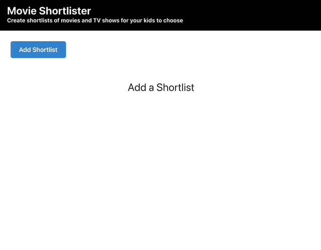

# Movie and TV Show Shortlist for Kids

This is a simple and user-friendly React.js application that allows parents to create shortlists of movies and TV shows for their children to watch. The app allows children to view the cover art and watch trailers for items that may be on different streaming platforms, without being able to see all the other films on offer.



## Getting Started

These instructions will get you a copy of the project up and running on your local machine for development and testing purposes.

### Prerequisites

You will need to have Node.js and npm (Node Package Manager) installed on your machine.

### Installing

1. Clone the repository to your local machine

```
git clone https://github.com/Stuart98/movie-selector.git
```


2. Install dependencies

```
npm install
```


3. Start the development server

```
npm start dev
```


4. Open [http://localhost:3000](http://localhost:3000) to view the app in the browser.

## Built With

- [React.js](https://reactjs.org/) - The web framework used
- [Chakra UI](https://chakra-ui.com/) - UI component framework
- [Vite](https://vitejs.dev/) - Front-end tooling
- [npm](https://www.npmjs.com/) - Dependency Management


## Authors

* **Stuart Ashworth** - [www.stuartashworth.com](https://www.stuartashworth.com)

## License

This project is licensed under the MIT License - see the [LICENSE.md](https://github.com/Stuart98/movie-selector/LICENSE.md) file for details